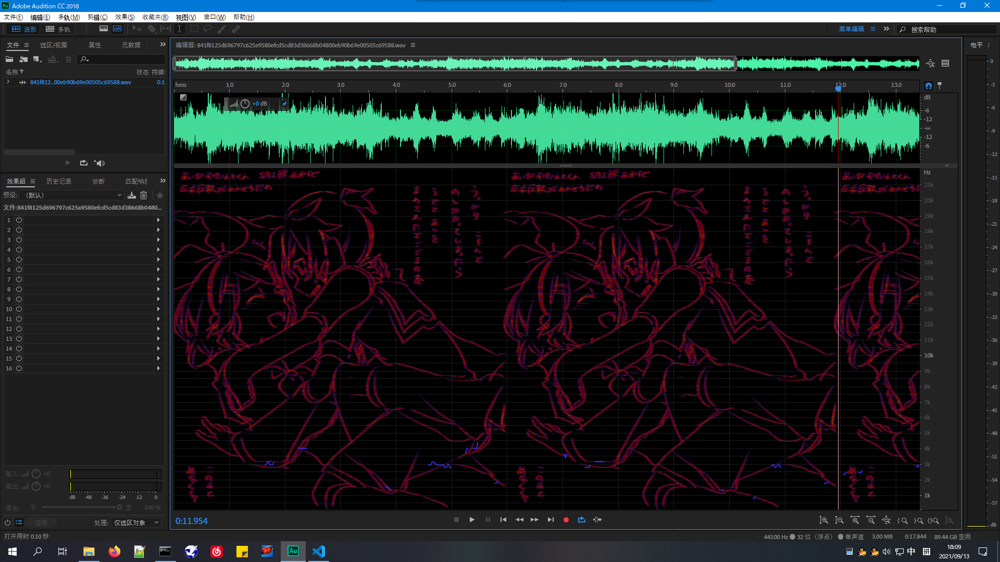
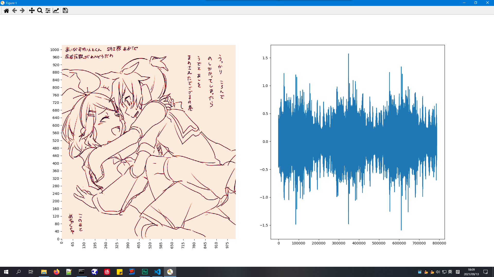

# img_to_wav

    Just blindly take an arbitary image as spectrum of some wired audio, generates that according <del>audio</del> noise :lol:

----

### How to Go ?

  - just run like `python3 img_to_wav.py <xxx.jpg>`, a `xxx.wav` file would be generated under `data` folder
  - for batch generation, put all your images under  `data` folder, run `python3 img_to_wav.py` without parameters
  - for several useless configurations, see `SPEC_MAX_VALUE` and `N_REPEAT` in main script

### requirements

  - librosa
  - pillow
  - scipy, numpy
  - matplotlib, seaborn

----

by Armit
2021/09/12 
